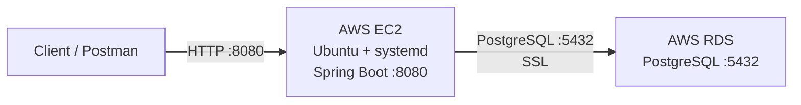

# Task Management API

A secure Spring Boot REST API for managing users and tasks, featuring JWT authentication, BCrypt password hashing, and PostgreSQL persistence.

## Tech Stack

- Java 17
- Spring Boot 4.0.5
- Spring Security + JWT
- Spring Data JPA / Hibernate
- PostgreSQL
- Maven
- AWS EC2 + RDS

## Features

- User registration and login
- BCrypt password hashing
- JWT-based authentication
- Protected task endpoints
- Task CRUD operations
- PostgreSQL persistence
- Global exception handling
- AWS deployment with automatic application startup via systemd

## Architecture

### AWS Deployment



**Deployment flow:**

```text
Client
  │
  │ HTTP :8080
  ▼
EC2
  │
  ├── systemd
  │      └── Spring Boot
  │
  │ PostgreSQL :5432
  ▼
RDS PostgreSQL
```

The Spring Boot application runs on an Ubuntu EC2 instance and connects to PostgreSQL hosted on RDS.

`systemd` manages the application and automatically starts it after an EC2 reboot.

Production credentials are supplied through environment variables and are not stored in the repository.

## Project Structure

```text
Backend/
├── src/main/java/com/example/demo/
│   ├── Config/
│   ├── Controller/
│   ├── Entity/
│   ├── Exception/
│   ├── Repository/
│   ├── Service/
│   └── dto/
├── src/main/resources/
│   └── application.properties
├── src/test/
├── pom.xml
└── mvnw
```

## Configuration

The application reads database and JWT configuration from environment variables:

```properties
spring.datasource.url=${DB_URL}
spring.datasource.username=${DB_USERNAME}
spring.datasource.password=${DB_PASSWORD}

jwt.secret=${JWT_SECRET}
jwt.expiration=86400000

app.cors.allowed-origins=${CORS_ALLOWED_ORIGINS:http://localhost:5173}
```

Example local configuration:

```bash
export DB_URL=jdbc:postgresql://localhost:5432/taskManager
export DB_USERNAME=your_username
export DB_PASSWORD=your_password
export JWT_SECRET=your_secret
export CORS_ALLOWED_ORIGINS=http://localhost:5173
```

> Never commit passwords, JWT secrets, or other credentials to Git.

## Running Locally

```bash
cd Backend
./mvnw clean install
./mvnw spring-boot:run
```

The API runs on:

```text
http://localhost:8080
```

## API Endpoints

| Method | Endpoint | Authentication |
|---|---|---|
| POST | `/user/register` | Public |
| POST | `/user/login` | Public |
| POST | `/task` | JWT required |
| GET | `/task` | JWT required |
| GET | `/task/{id}` | JWT required |
| PUT | `/task/{id}` | JWT required |

### Example

Register:

```bash
curl -X POST http://localhost:8080/user/register \
  -H "Content-Type: application/json" \
  -d '{"username":"alice","password":"secret123"}'
```

Login:

```bash
curl -X POST http://localhost:8080/user/login \
  -H "Content-Type: application/json" \
  -d '{"username":"alice","password":"secret123"}'
```

Use the returned JWT:

```bash
curl http://localhost:8080/task \
  -H "Authorization: Bearer <your_jwt_token>"
```

## AWS Deployment

| Component | Purpose |
|---|---|
| EC2 | Hosts Spring Boot application |
| RDS PostgreSQL | Production database |
| systemd | Application process management |
| Security Groups | Network access control |

The RDS instance accepts PostgreSQL connections from the EC2 security group on port `5432`.

The application runs on EC2 using:

```text
/opt/task-management/demo-0.0.1-SNAPSHOT.jar
```

and is managed by:

```text
task-management.service
```

Useful commands:

```bash
sudo systemctl status task-management
sudo systemctl restart task-management
sudo journalctl -u task-management -f
```

## Deployment Verification

- ✅ EC2 → RDS connectivity
- ✅ User registration
- ✅ Login and JWT generation
- ✅ Protected task endpoints
- ✅ Task CRUD
- ✅ systemd automatic startup
- ✅ Application verified after EC2 reboot

## Future Improvements

- Nginx reverse proxy
- HTTPS / custom domain
- AWS Secrets Manager
- CI/CD with GitHub Actions
- Monitoring and centralized logging
- Docker / ECS deployment
